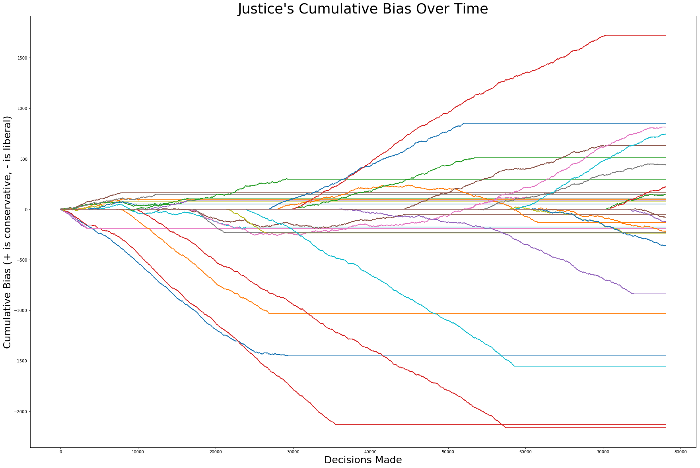

# Predicting the Decisions of Supreme Court Justices

## Authors: William Hinthorn, Maia Ezratty, Mihika Kapoor, Alice Zheng

### COS 424 Final Project

For more notes, see our [wiki](https://github.com/hinthornw/supreme_predictions/wiki).

Dataset: 
Harold J. Spaeth, Lee Epstein, Andrew D. Martin, Jeffrey A. Segal, Theodore J. Ruger, and Sara C. Benesh. 2016 Supreme Court Database, Version 2016 Release 01. URL: http://Supremecourtdatabase.org 

To download the dataset, go to the [website](http://scdb.wustl.edu/data.php) and download the case-centered [csv file](http://scdb.wustl.edu/_brickFiles/2016_01/SCDB_2016_01_caseCentered_Citation.csv.zip). 

##### The dataset contains  of 8,737 cases with the following headers:

caseId, 
docketId, 
caseIssuesId, 
voteId, 
dateDecision, 
decisionType, 
usCite, 
sctCite, 
ledCite, 
lexisCite, 
term, 
naturalCourt, 
chief, 
docket, 
caseName, 
dateArgument, 
dateRearg, 
petitioner, 
petitionerState, 
respondent, 
respondentState, 
jurisdiction, 
adminAction, 
adminActionState, 
threeJudgeFdc, 
caseOrigin, 
caseOriginState, 
caseSource, 
caseSourceState, 
lcDisagreement, 
certReason, 
lcDisposition, 
lcDispositionDirection, 
declarationUncon, 
caseDisposition, 
partyWinning, 
precedentAlteration, 
voteUnclear, 
issue, 
issueArea, 
decisionDirection, 
decisionDirectionDissent, 
authorityDecision1, 
authorityDecision2, 
lawType, 
lawSupp, 
lawMinor, 
majOpinWriter, 
majOpinAssigner, 
splitVote, 
majVotes, and
minVotes

##### The second dataset is [justice centered](http://scdb.wustl.edu/_brickFiles/2016_01/SCDB_2016_01_justiceCentered_Citation.csv.zip) (same source).

It has field names: 
caseId,
docketId,
caseIssuesId,
voteId,
dateDecision,
decisionType,
usCite,
sctCite,
ledCite,
lexisCite,
term,
naturalCourt,
chief,
docket,
caseName,
dateArgument,
dateRearg,
petitioner,
petitionerState,
respondent,
respondentState,
jurisdiction,
adminAction,
adminActionState,
threeJudgeFdc,
caseOrigin,
caseOriginState,
caseSource,
caseSourceState,
lcDisagreement,
certReason,
lcDisposition,
lcDispositionDirection,
declarationUncon,
caseDisposition,
caseDispositionUnusual,
partyWinning,
precedentAlteration,
voteUnclear,
issue,
issueArea,
decisionDirection,
decisionDirectionDissent,
authorityDecision1,
authorityDecision2,
lawType,
lawSupp,
lawMinor,
majOpinWriter,
majOpinAssigner,
splitVote,
majVotes,
minVotes,
justice,
justiceName,
vote,
opinion,
direction,
majority,
firstAgreement,
secondAgreement,

We used feature selection, generation, and ranom forests classifiers to build a flexible model which predicts the decisions of the court with an average accuracy of ~80-90%. We obtained similar results by building dedicated models for individual justices.

Here are some cool findings:

We found out that judges tend to stay true to their original biases throughout the length of their term. 

Except for a few outliers, like Harry Blackmun, who we assume was influenced by the world wars and the New Deal programs to turn an early conservative Justice into an liberally-minded older man. Note that the moderates tend to have shorter terms (though we do not imply any health benefits of having a political bias).

These biases play a huge role on the bias of the court at large. We show the cumulative sum of justice's voting biases spread out over the cases that are included within the dataset.

We looked at correlations in voting habits of justices over the length of the term covered by the modern dataset (seen below)

And generated features based on clustering methods:

